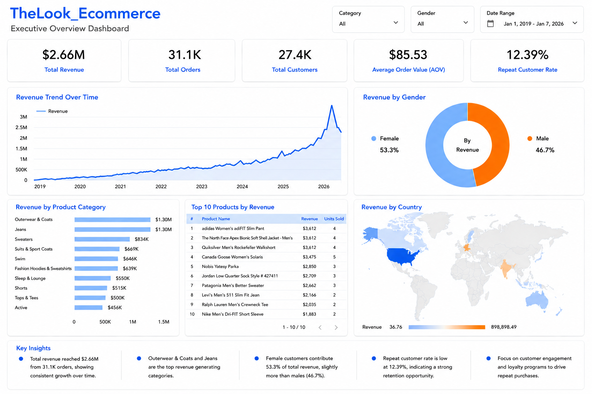
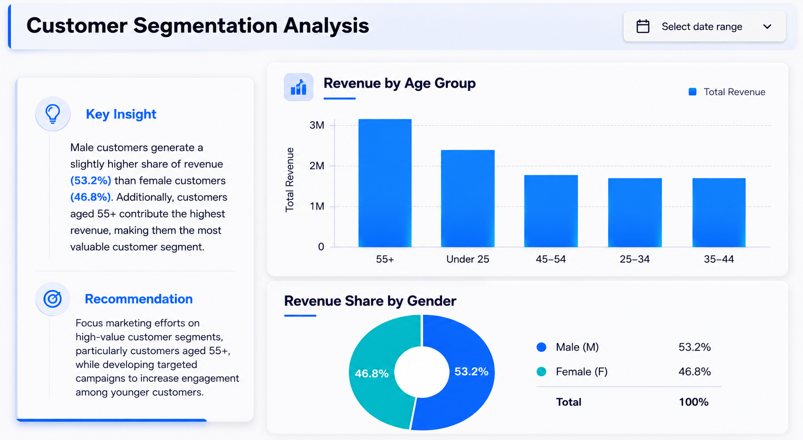
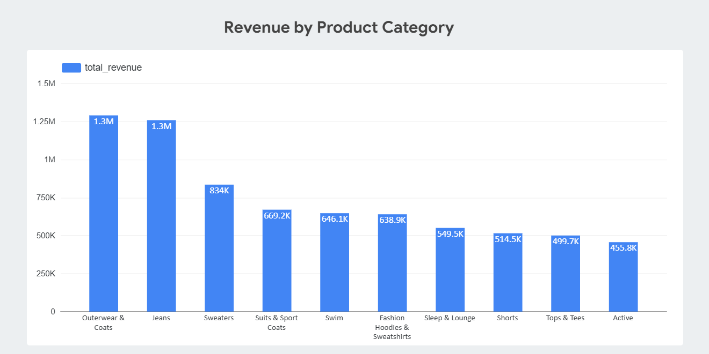
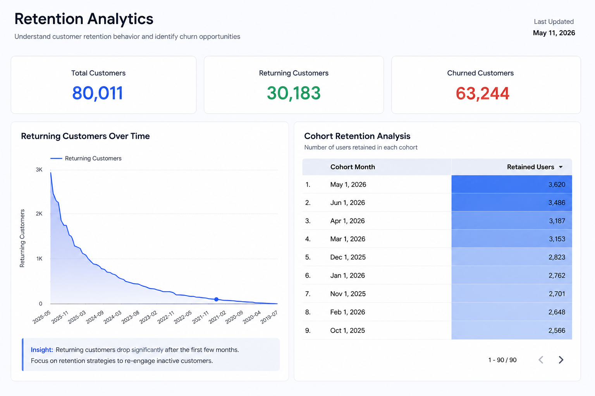
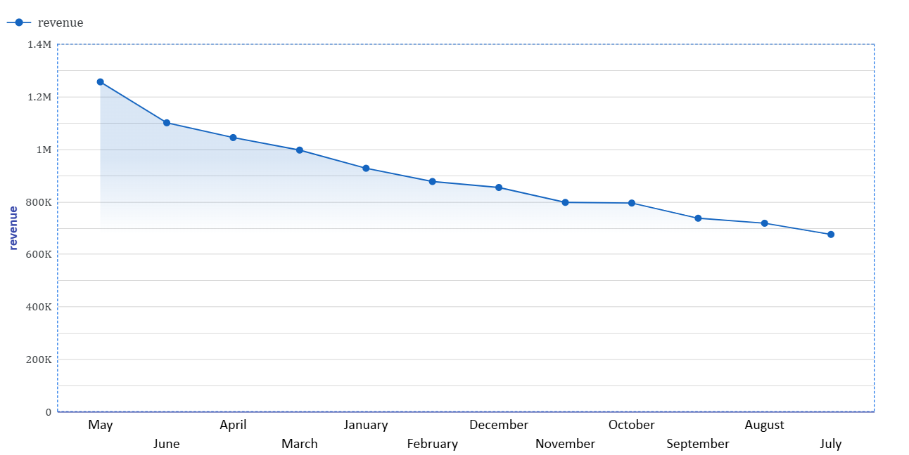

# TheLook Ecommerce Analytics Dashboard

## Project Overview

This project analyzes the TheLook Ecommerce dataset using SQL, Google BigQuery, and Power BI. The objective was to transform raw ecommerce data into actionable business insights by examining sales performance, customer behavior, product trends, and customer retention.

The project provides interactive dashboards and executive-level reporting to support data-driven decision-making.

---

## Project Goals

- Analyze revenue performance and growth trends
- Identify high-performing product categories
- Understand customer demographics and purchasing behavior
- Measure customer retention and repeat purchase patterns
- Deliver business recommendations through interactive dashboards

---

## Tools & Technologies

- SQL
- Google BigQuery
- Power BI
- Data Analysis
- Business Intelligence
- Data Visualization

---

## Key Business Questions

### Sales Performance
- How has revenue changed over time?
- Which countries generate the highest revenue?
- What is the average order value?

### Product Analysis
- Which product categories generate the most revenue?
- Which products are top performers?

### Customer Analysis
- Which customer segments are most valuable?
- How does revenue differ across gender and age groups?

### Retention Analysis
- What percentage of customers return?
- How does customer retention change over time?

---

## Key Results

- Total Revenue: $2.66M
- Total Orders: 31.1K
- Total Customers: 27.4K
- Average Order Value: $85.53
- Repeat Customer Rate: 12.39%

### Major Insights

- Revenue showed strong growth over time.
- Outerwear & Coats and Jeans generated the highest revenue.
- Customers aged 55+ generated the largest share of revenue.
- Female customers contributed slightly more revenue than male customers.
- Customer retention decreases significantly after the first few months.
- Repeat purchase opportunities remain a major growth area.

---

## Dashboard Screenshots

### Executive Overview Dashboard



---

### Customer Segmentation Dashboard



---

### Product Revenue Analysis



---

### Retention Analytics Dashboard



---

### Revenue Trend Analysis



---

## Repository Structure

```text
thelook-ecommerce-analytics
│
├── README.md
├── presentation.pptx
│
├── sql
│   └── ecommerce_analysis.sql
│
└── screenshots
    ├── executive_dashboard.png
    ├── customer_dashboard.png
    ├── product_dashboard.png
    ├── retentation_dashboard.png
    └── reveneu trend bty month_dashboard.png
```

## Deliverables

- SQL Analysis Scripts
- Executive Dashboard
- Customer Analytics Dashboard
- Product Performance Dashboard
- Retention Analytics Dashboard
- Business Presentation

---

## Author

Muhiddin

MBA in IT | Data Analyst

SQL • Python • Power BI • BigQuery • Data Visualization
